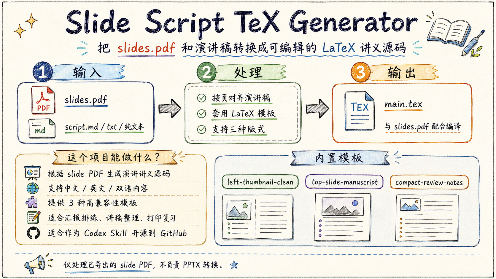

<div align="center">

# 📝 Slide Script TeX Generator

### 用于从幻灯片 PDF 与讲稿生成 PDF-first 演讲讲义的 Codex Skill

[English](./README.md) · [示例](./examples) · [模板](./assets/templates) · [Skill 规范](./SKILL.md) · [安装说明](./INSTALL.md)


</div>

## 项目做什么

输入：
- 已导出的 `slides.pdf`
- 逐页讲稿

标准流程：
1. 从 `slides.pdf` 和讲稿生成 `main.tex`。
2. 通过可用的 LaTeX/PDF 工具链将 `main.tex` 编译为 `main.pdf`。
3. 交付 `main.pdf` 作为标准最终产物。

降级流程：
- 若 PDF 编译不可用、被用户拒绝、或在合理修复后仍失败，则交付 `main.tex` 并附准确编译命令。

PDF 生成是优先且标准完成路径。
TeX 生成是必要中间步骤。
仅输出 TeX 是降级路径。



## 快速开始

```text
Use the slide-script-tex-generator skill.

I have slides.pdf and a page-by-page script.
Generate a PDF-first handout with default top-slide-manuscript layout.
Return main.pdf if compilation tooling is available.
If not, return full main.tex and exact compile commands.
```

中文调用示例：

```text
使用 slide-script-tex-generator skill。

我有 slides.pdf 和逐页讲稿。
请使用默认 top-slide-manuscript 版式按 PDF-first 流程生成。
若工具可用，请返回 main.pdf；否则返回完整 main.tex 和精确编译命令。
```

## 输入与交付物

**必需输入**
- `slides.pdf`

**推荐输入**
- `script.md` / `script.txt` / 直接粘贴讲稿

**主要交付物**
- `main.pdf`

**中间构建产物**
- `main.tex`

**降级交付物**
- `main.tex`（附编译命令与降级原因）

## 标准 PDF-first 工作流

1. 规范化并按页对齐讲稿。
2. 生成完整 `main.tex`。
3. 在工具可用时尝试编译为 `main.pdf`。
4. 优先返回 `main.pdf`。
5. 仅在降级条件满足时返回 `main.tex`。

## 版式（Layouts）

### 1) `top-slide-manuscript`（默认）
- 上方大图，下方讲稿。
- 支持可选自适应字号。

### 2) `left-thumbnail-clean`
- 左侧 slide，右侧讲稿。

### 3) `compact-review-notes`
- 紧凑打印复习版式。

## 讲稿切分规则

1. 按 `---` 切分
2. 按标题（`Slide 1`、`Page 1`、`第1页`）切分
3. 按编号段落切分
4. 无分隔时按页数近似切分

## 生成行为

- 讲稿段落不足：补占位。
- 讲稿段落超出：追加到 `Extra Notes`。
- 空白/分隔页：先询问保留或跳过。
- 正文需进行 LaTeX 特殊字符转义。

## PDF 生成与降级行为

优先编译工具：
- Codex LaTeX/Tectonic plugin/tooling（可用时优先）。

本地回退编译命令：
```bash
xelatex main.tex
xelatex main.tex
```

可选本地命令：
```bash
tectonic main.tex
```

仅在以下情况降级为 TeX-only：
1. 所需 PDF 编译插件/工具不可用；
2. 用户明确拒绝安装或启用；
3. 编译在合理修复后仍失败；
4. 环境无法写出或返回 PDF 文件；
5. 用户明确只要 TeX 源码。

## 安装

快速安装：

```text
$skill-installer install https://github.com/Qrzzzz/slide-script-tex-generator
```

详细安装与 PDF 编译工具要求见 [INSTALL.md](./INSTALL.md)。

## 项目结构

```text
slide-script-tex-generator/
├── SKILL.md
├── README.md
├── README-CN.md
├── INSTALL.md
├── CONTRIBUTING.md
├── CHANGELOG.md
├── LICENSE
├── assets/
│   ├── overview-en.png
│   ├── overview-cn.png
│   └── templates/
│       ├── top-slide-manuscript.tex
│       ├── left-thumbnail-clean.tex
│       └── compact-review-notes.tex
├── references/
│   ├── template-style-guide.md
│   ├── script-splitting-rules.md
│   ├── latex-compatibility-notes.md
│   └── post-generation-checklist.md
└── examples/
    ├── sample-script.md
    ├── sample-script-bilingual.md
    ├── sample-main-top-slide-manuscript.tex
    ├── sample-main-left-thumbnail.tex
    ├── sample-main-compact-review-notes.tex
    ├── sample-main-extra-notes.tex
    └── sample-main-missing-script.tex
```

## 本 skill 不做什么

- 不负责 PPTX 转 PDF
- 不执行 OCR
- 不会在 `main.pdf` 实际不存在时声称已成功生成 PDF

## 示例

示例目录提供可复现的 TeX 源码。标准 skill 流程会在编译工具可用时将其编译为 PDF。

## 许可证

本项目使用 [LICENSE](./LICENSE)。
