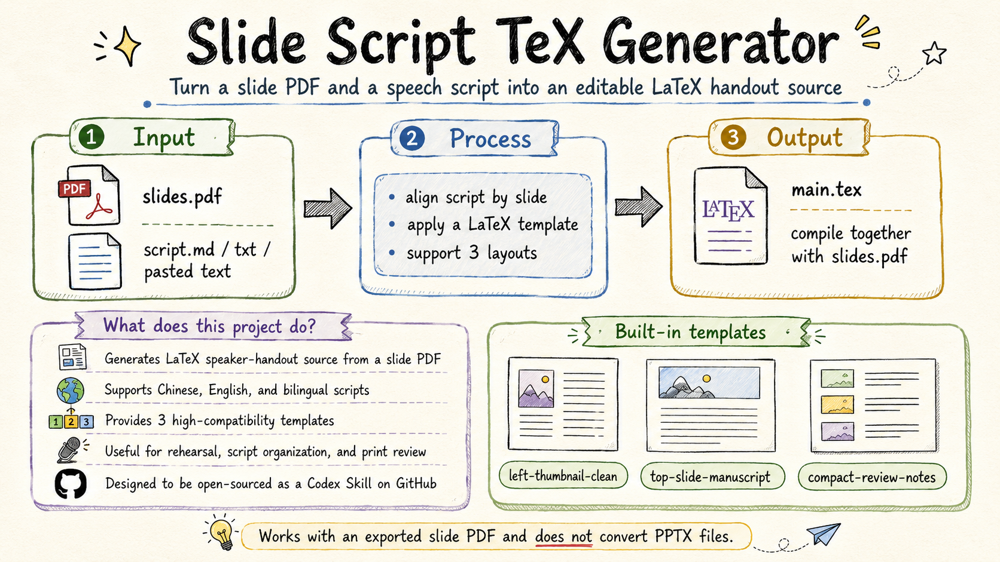

<div align="center">

# 📝 Slide Script TeX Generator

### A lightweight Codex Skill for generating LaTeX speaker handouts from slide PDFs

**Slide PDF / Speech Script / LaTeX Source / Speaker Notes / Bilingual Friendly**

[中文](./README-CN.md) · [Examples](./examples) · [Templates](./assets/templates) · [Skill](./SKILL.md)


</div>

---

## Overview

**Slide Script TeX Generator** is a minimal Codex Skill that turns an exported slide PDF and a speech script into a standalone LaTeX source file.

It is designed for students, presenters, teachers, and anyone who wants to organize presentation scripts together with slide previews.



---

## Default-first workflow (latest)

`top-slide-manuscript` is the default style.

This default style places a large slide preview at the top of each page and the corresponding speech manuscript below it. It is designed for rehearsal, reading, and page-by-page alignment.

Before generating the final `.tex`, the skill must ask (unless already explicitly answered):

1. whether to use the default `top-slide-manuscript` layout
2. how the script is split (`---`, slide headings, or needs approximate splitting)
3. whether adaptive per-slide manuscript font sizing is allowed
4. how to handle possible blank/divider/transition pages

---

## Install in Codex

This project can be used as a Codex Skill. A Codex Skill is essentially a folder that contains a `SKILL.md` file. After installation, Codex can invoke this workflow when you need to convert a slide PDF and a page-by-page script into a LaTeX handout source file.

### Method 1: Ask Cursor to install it automatically

You can paste the following instruction into Cursor and let it install the skill in your local Codex environment:

```text
Please install this GitHub repository as a Codex Skill:

https://github.com/Qrzzzz/slide-script-tex-generator

Requirements:
1. Download or clone the entire repository into the Codex skills directory.
2. If CODEX_HOME is set, install it to $CODEX_HOME/skills/slide-script-tex-generator.
3. If CODEX_HOME is not set, install it to ~/.codex/skills/slide-script-tex-generator.
4. Verify that SKILL.md exists in the target directory.
5. After installation, remind me to restart Codex or start a new Codex session.
6. Do not copy only the README. Keep SKILL.md, assets, references, examples, and the full folder structure.
```

After installation, you can invoke it in Codex like this:

```text
Use the slide-script-tex-generator skill.

I have slides.pdf and script.md.
Please generate a LaTeX handout using the top-slide-manuscript layout (default).
Only output the final main.tex source code.
```

Or:

```text
$slide-script-tex-generator

Please generate a top-slide-manuscript style LaTeX handout source file based on slides.pdf and my page-by-page presentation script.
```

### Method 2: Use Codex's built-in skill installer

Inside Codex, run:

```text
$skill-installer install https://github.com/Qrzzzz/slide-script-tex-generator
```

If your Codex version expects a GitHub tree URL, try:

```text
$skill-installer install https://github.com/Qrzzzz/slide-script-tex-generator/tree/main
```

After installation, restart Codex or open a new Codex session.

### Method 3: Manual command-line installation

macOS / Linux / WSL:

```bash
mkdir -p "${CODEX_HOME:-$HOME/.codex}/skills"

rm -rf "${CODEX_HOME:-$HOME/.codex}/skills/slide-script-tex-generator"

git clone https://github.com/Qrzzzz/slide-script-tex-generator.git \
  "${CODEX_HOME:-$HOME/.codex}/skills/slide-script-tex-generator"

test -f "${CODEX_HOME:-$HOME/.codex}/skills/slide-script-tex-generator/SKILL.md" \
  && echo "Installed successfully. Restart Codex to use the skill."
```

Windows PowerShell:

```powershell
$CodexHome = if ($env:CODEX_HOME) { $env:CODEX_HOME } else { Join-Path $env:USERPROFILE ".codex" }
$SkillsDir = Join-Path $CodexHome "skills"
$SkillDir = Join-Path $SkillsDir "slide-script-tex-generator"

New-Item -ItemType Directory -Force -Path $SkillsDir | Out-Null

if (Test-Path $SkillDir) {
    Remove-Item -Recurse -Force $SkillDir
}

git clone https://github.com/Qrzzzz/slide-script-tex-generator.git $SkillDir

if (Test-Path (Join-Path $SkillDir "SKILL.md")) {
    Write-Host "Installed successfully. Restart Codex to use the skill."
} else {
    Write-Host "Installation failed: SKILL.md was not found."
}
```

### Verify installation

After installation, check whether the following file exists:

```text
~/.codex/skills/slide-script-tex-generator/SKILL.md
```

Then restart Codex or start a new Codex session. You can use `/skills` to check whether the skill is detected, or invoke it directly in your prompt:

```text
Use the slide-script-tex-generator skill.
```

---

## What it does

Given:

```text
slides.pdf
script.md / script.txt / pasted text
```

It generates:

```text
main.tex
```

The generated LaTeX file references individual pages from the slide PDF directly:

```latex
\includegraphics[page=1,width=0.4\textwidth]{slides.pdf}
```

This means the slide PDF stays as the visual source, while the speech script is aligned page by page in a clean LaTeX handout.

---

## Core features

- Generate a standalone `.tex` file from a slide PDF and a speech script
- Align script content with corresponding slide pages
- Support Markdown, plain text, txt, or pasted script content
- Support Chinese, English, and bilingual scripts
- Provide three high-compatibility LaTeX templates
- Keep the workflow simple, editable, and GitHub-friendly

---

## Available layouts

### `left-thumbnail-clean`

The slide thumbnail appears on the left, and the speech script appears on the right.

Best for:

- formal presentations
- speaker handouts
- bilingual scripts
- slide-by-slide explanation

---

### `top-slide-manuscript`

The slide preview appears at the top, and the full manuscript appears below.

Best for:

- rehearsal
- memorization
- full speech scripts
- presentation practice

---

### `compact-review-notes`

A compact layout for printing, review, and rehearsal.

Best for:

- short notes
- print-friendly documents
- quick review
- reduced page usage

---

## Recommended working directory

```text
my-presentation/
  slides.pdf
  script.md
  main.tex
```

The generated `.tex` file assumes that `slides.pdf` is in the same folder.

---

## Example usage with Codex

You can ask Codex:

```text
Use the slide-script-tex-generator skill.

I have slides.pdf and the following speech script.
Generate a left-thumbnail-clean LaTeX handout.
Only output the final main.tex source.
```

Or:

```text
Use the slide-script-tex-generator skill.

Generate a compact review version from slides.pdf and script.md.
The script is separated by ---.
```

---

## Script splitting

The skill tries to split the script in this order:

1. Markdown separators:

```markdown
---
```

2. Slide headings:

```text
Slide 1
Page 1
第1页
第 1 页
P1
```

3. Numbered sections

4. Approximate splitting by slide count, if needed

The skill preserves all user content. Extra script sections are kept as additional notes.

---

## Generation checklist

After generating the `.tex`, the skill checks common issues such as:

- slide/script mismatch
- missing `\newpage`
- wrong PDF filename
- raw Markdown left in LaTeX
- unescaped LaTeX special characters
- absolute local paths
- missing placeholders for slides without scripts

---

## What this skill does not do

This skill intentionally stays narrow.

It does not:

- convert PPTX to PDF
- compile LaTeX
- perform OCR
- install dependencies
- create a full project folder
- rasterize PDF pages into images

Please export your presentation as `slides.pdf` before using this skill.

---

## Project structure

```text
slide-script-tex-generator/
  SKILL.md
  README.md
  README.cn.md
  assets/
    overview-en.png
    overview-cn.png
    templates/
      left-thumbnail-clean.tex
      top-slide-manuscript.tex
      compact-review-notes.tex
  references/
    template-style-guide.md
    script-splitting-rules.md
    latex-compatibility-notes.md
  examples/
    sample-script.md
    sample-output-left-thumbnail.tex
```

---

## Compile the generated file

After Codex generates `main.tex`, place it in the same directory as `slides.pdf`, then compile with XeLaTeX:

```bash
xelatex main.tex
xelatex main.tex
```

LaTeX compilation is outside the skill itself. The skill stops after generating the `.tex` source.

---

## License

This project is released under the MIT License.
